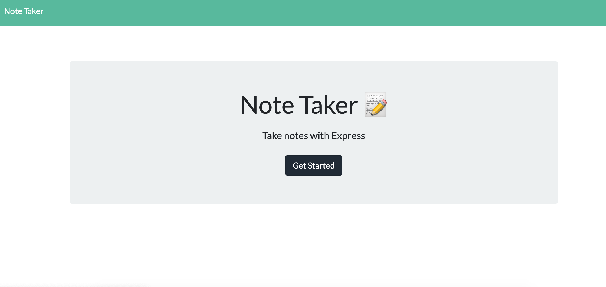
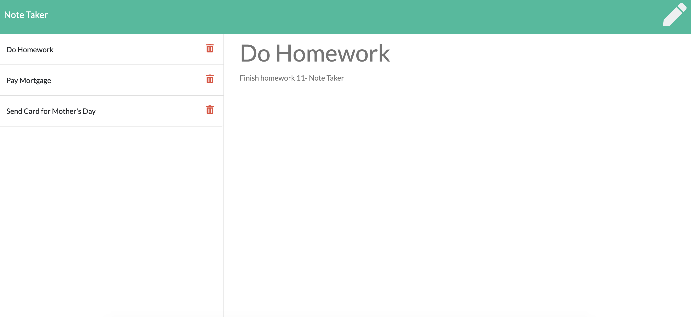

  # Project Name:

  HW 11 - Note Taker
  
  ## Live Application
  
  - [View Deployed Application Here](https://immense-brushlands-28797.herokuapp.com/)

  ## License

   : [View License](https://www.gnu.org/licenses/gpl-3.0)

  ## Table of Contents

  - [Title](#Project-Name)
  - [License](#License)
  - [Description](#Description)
  - [Installation](#Installation)
  - [Usage](#Usage)
  - [Contributions](#Contributions)
  - [Tests](#Tests)
  - [Questions](#Questions)

  ## Description

  My assignment is to modify starter code to create a Note Taker application that can be used to write and save notes. The application will have an Express.js back end and will save and retrieve note data from a JSON file. The application's front end has already been created. It is my job to build the back end, connect to the front end, and deploy the application to Heroku.

  ## Installation

  Navigate to the root directory of this repository and run the following commands to install necessary dependencies:

    npm i

  ## Usage

  

  ## Contributions 

  

  ## Tests 

  npm test

  ## Questions 

  For issues, questions, and comments please contact epurpur@gmail.com or visit [https://github.com/epurpur](https://github.com/epurpur) 
  
  ## Preview
  
  
  
  
  
